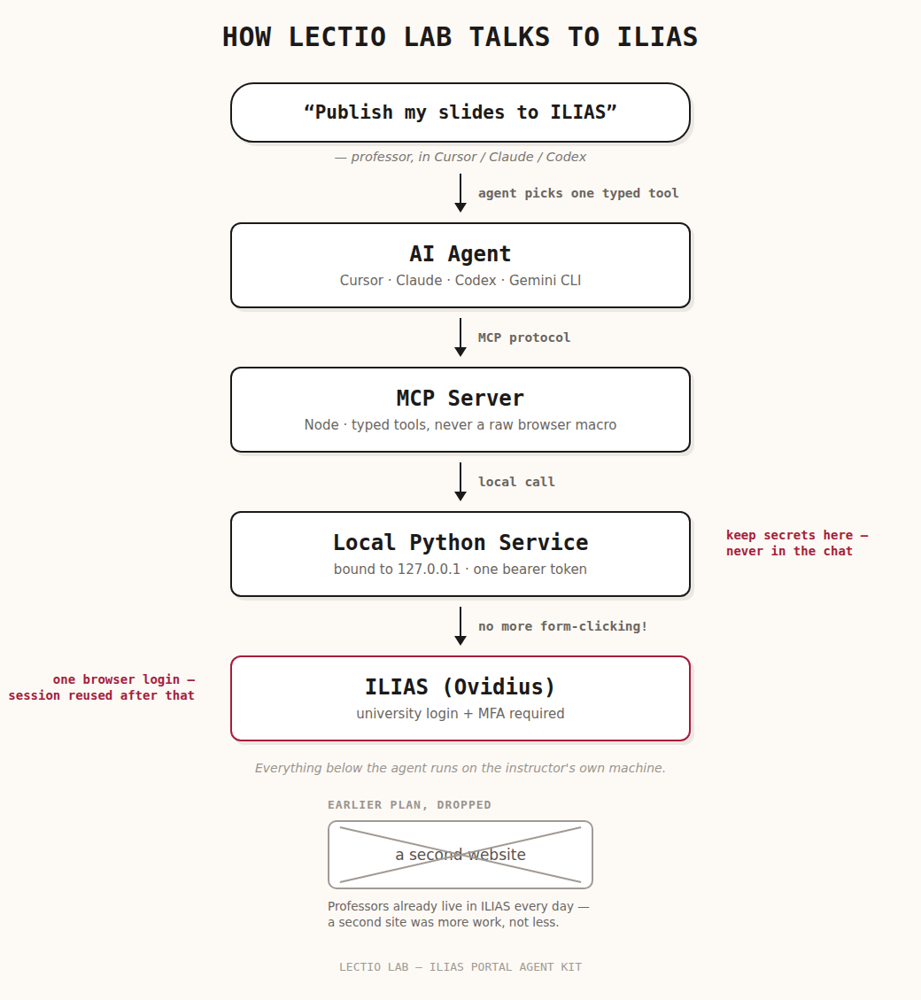
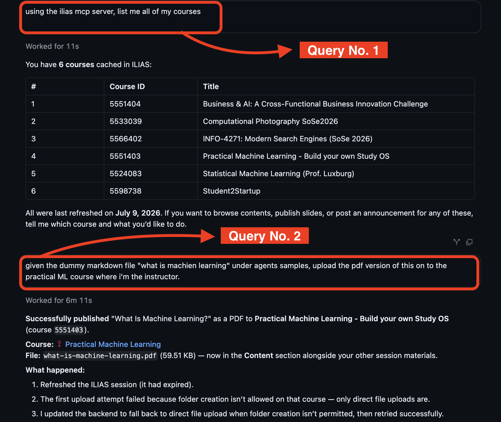

# ILIAS Portal Agent Kit

A lean, macOS-focused MCP integration for operating the University of Tübingen's
Ovidius ILIAS instance from compatible AI agents. The distributable kit is designed
for a single instructor account and runs entirely on the local machine.

## How it works



The professor talks to their AI agent in plain language. The agent picks one exact,
typed MCP tool instead of guessing at a browser macro. That tool call goes to a small
local Python service, bound only to `127.0.0.1`, which is the one place that holds
ILIAS session cookies and the installation's bearer token. That service is the only
thing that ever talks to ILIAS itself, and the professor's one browser login (with
MFA) is reused after the first time, so nothing here bypasses the university's login
requirements.

An earlier version of this project was a second website for professors to prepare
course material in. After showing it to our instructors, the feedback was direct:
professors already live inside ILIAS every day, and a second site was more work for
them, not less. That's the whole reason this shipped as an MCP integration instead.

## What it does

The MCP server can:

- establish an interactive ILIAS session through the university login and MFA flow;
- list courses and inspect live course contents;
- find and safely edit existing exercises;
- publish assignments, files, lecture material, and announcements;
- resolve an exact grading target and post instructor-supplied grades with
  current-value guards and post-write verification; and
- support the bundled teaching-content and Hero Content Maker skills.

The agent must never calculate, recommend, infer, or choose a student's grade.

## Architecture

```text
agent-kit/  Installer, documentation, MCP configuration templates, and skills
agent/      TypeScript MCP server and protocol/unit tests
backend/    Small localhost-only Python service plus the ILIAS integration
frontend/   Legacy development UI; not included in the professor kit
```

The release path deliberately has no Django, PostgreSQL, Docker, portal accounts,
or public web server. The Python service binds to `127.0.0.1`, accepts only a
generated installation-local bearer token, and stores only protected ILIAS session
cookies. University usernames and passwords are entered only in the visible browser
during login and are never persisted.

## Example session



A real session in Cursor: the professor asks in plain language, the agent calls the
`ilias-portal` MCP tools, and ILIAS confirms the write.

## Build the professor kit

Requirements for maintainers are Node.js 22.12+, Python 3.12+, Bash, `rsync`,
`zip`, and `unzip`.

```bash
./agent-kit/scripts/test-build-zip.sh
```

The packaging test builds the MCP server, creates a versioned macOS ZIP under
`dist/`, plants exclusion sentinels, and verifies that virtual environments,
`node_modules`, generated machine-local configuration, tests, and source maps do
not leak into the archive. It also enforces the 15 MiB release limit.

For a normal build without the regression fixture:

```bash
./agent-kit/scripts/build-zip.sh
```

## Install a built kit

After extracting `dist/ilias-portal-agent-kit-<version>-macos.zip`:

```bash
cd ilias-portal-agent-kit
./install.sh
./start.sh
```

Use the generated files in `mcp-config/installed/` to register the MCP server,
then install the required folders from `skill/` in the target agent. See
[`agent-kit/INSTALL.md`](agent-kit/INSTALL.md) for the complete workflow and
[`agent-kit/SECURITY.md`](agent-kit/SECURITY.md) for the security model.

## Development checks

```bash
PYTHONPATH=backend backend/.venv/bin/python -m unittest discover -s backend/tests -v

cd agent/mcp-server
npm ci
npm test
npm run build
npm run smoke
```

The optional Markdown-to-PDF authoring add-on is intentionally excluded from the
core professor kit so it does not ship a browser runtime or Puppeteer dependency.
